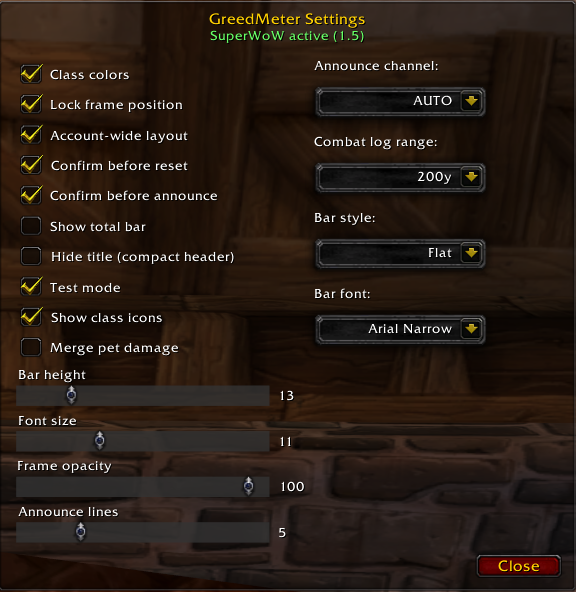
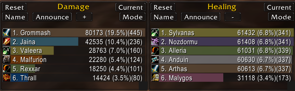

# GreedMeter

A lightweight combat meter for Vanilla 1.12 (and private servers based on it).

GreedMeter tracks damage, healing, dispels, interrupts, hard CCs, CC breaks, damage taken, and deaths. It is designed to work cleanly on classic clients, with optional SuperWoW support for more accurate pet ownership and combat-log range.

### Features

* **Multiple meter windows** – Open extra frames (up to 6) so you can watch Damage, Healing, Interrupts, etc. at the same time
* **Modes** – Damage, Healing, Dispels, Damage Taken, Interrupts, CC, CC Breaks, Deaths
* **Segments** – Current fight, Overall, recent fights, and recent boss fights
* **Absorbs automatically included in healing**
* **CC tracking** – Lists enemies that were crowd-controlled (estimated duration)
* **Class icons** – Optional class icons before player names on the bars
* **Combat log range** – Expand beyond the default 40 yards (up to 200) so distant raid members are still tracked
* **Announce** – Report a window to SAY / PARTY / RAID (with optional confirmation)
* **Name filter** – Quickly hide individual players from a window
* **Layout saving** – Position, size, mode, and shown state saved per character (or account-wide if enabled in settings)
* **Minimap button** – Left-click toggle meters, right-click settings, drag to reposition
* **Settings** – Class colors, bar height, font size, opacity, lock frames, 3 bar styles (Default, Smooth, Flat), 4 fonts (Friz Quadrata, Arial Narrow, Morpheus, Skurri), and more

### Commands

| Command | What it does |
|---------|--------------|
| `/gdm` or `/gdm show` | Show / hide all meter windows |
| `/gdm set` or `/gdm settings` | Open the settings window |
| `/gdm reset` | Clear all recorded combat data |
| `/gdm range` | Show current combat log range |
| `/gdm range 200` | Set combat log range to 200 yards |
| `/gdm range 40` | Restore default 40-yard range |
| `/gdm test` | Load fake 40-player raid data for UI testing |
| `/gdm help` | Show this help |

### Installation

1. Place the `GreedMeter` folder into your `Interface/AddOns` directory.
2. Restart the client or type `/reload`.

For the OctoLauncher / GitAddonsManager update system to work, install via Git so the `.git` folder is present.

### Notes

Works on standard Vanilla 1.12 clients. SuperWoW is optional but recommended — it improves pet ownership detection and gives a cleaner combat-log path.

Free to use and modify under the MIT License.
